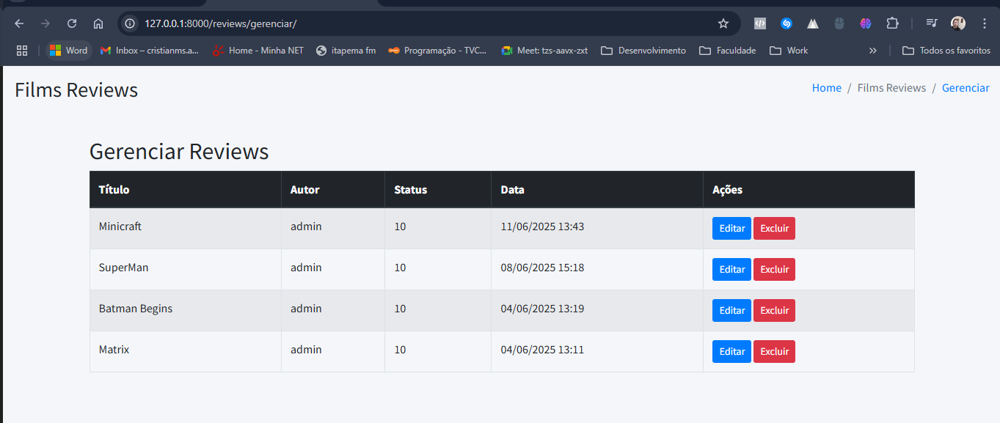
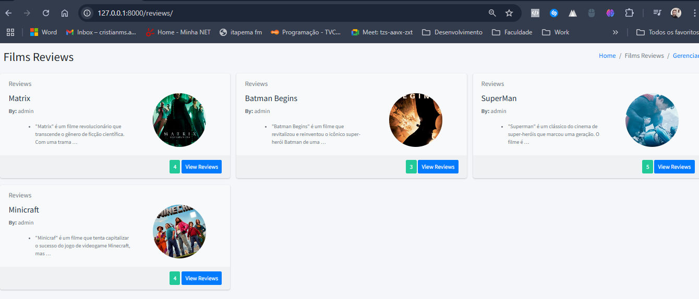
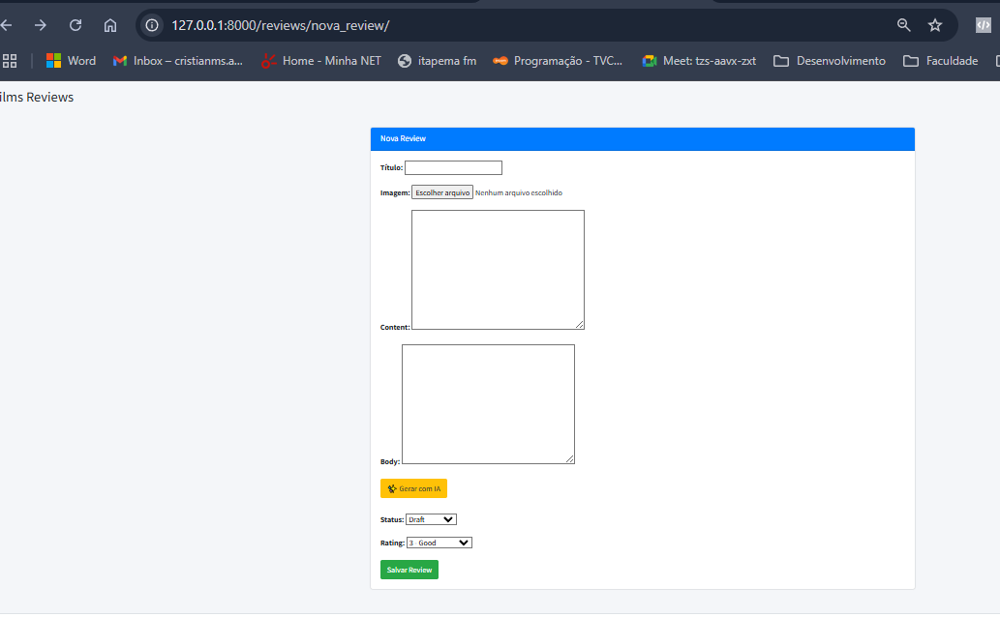

🎬 Film Reviews + IA Generativa
Sistema completo em Django para cadastro, listagem, geração e gerenciamento de resenhas de filmes — com integração de IA Generativa (GenAI) via OpenRouter/OpenAI.

🚀 Melhorias com IA implementadas
Geração automática de reviews com IA Generativa (GPT-3.5 via OpenRouter)

Integração com API segura usando variável .env

Botão de IA no formulário de criação de review no Django Admin e interface personalizada

Interface de gerenciamento com funcionalidades de edição e exclusão de reviews

Suporte completo a upload e exibição de imagens dos filmes

Interface moderna baseada em AdminLTE + Bootstrap

💡 Demonstração prática de GenAI
Este projeto integra IA Generativa no fluxo de criação de conteúdo:

# Exemplo de payload enviado para a IA
data = {
    "model": "openai/gpt-3.5-turbo",
    "messages": [
        {"role": "user", "content": f"Escreva uma crítica sobre o filme '{title}'"}
    ]
}

A IA responde com uma resenha que é automaticamente preenchida no formulário, otimizando a criação de conteúdo com criatividade assistida.

🧪 Tecnologias utilizadas
Backend: Django 5.2

Linguagem: Python 3.12

IA Generativa: OpenAI via OpenRouter API

Frontend: AdminLTE 3, Bootstrap 4

Banco de Dados: SQLite 3

Infraestrutura Local: Simulando ambiente de produção com restrições reais de hospedagem

📋 Funcionalidades
Página de listagem pública de reviews com imagem, nota e título

Página detalhada de cada review

Cadastro via painel personalizado

Geração automática de texto com IA

Upload de imagens dos filmes

Página de gerenciamento com tabela de edição e exclusão

Autenticação via Django

Templates reaproveitáveis com herança HTML (base.html)

📁 Estrutura do Projeto
film_review/
├── reviews/
│   ├── templates/reviews/
│   │   ├── base.html
│   │   ├── list.html
│   │   ├── detail.html
│   │   ├── nova_review.html
│   │   └── gerenciar.html
│   ├── views.py
│   ├── urls.py
│   ├── models.py
│   ├── forms.py
├── film_review/
│   ├── settings.py
│   └── urls.py
├── static/
│   └── img/
├── media/
└── db.sqlite3

🧰 Setup local
git clone https://github.com/cristianawktec/film-reviews.git
cd film-reviews

python -m venv venv
source venv/bin/activate  # Linux/Mac
venv\Scripts\activate     # Windows

pip install -r requirements.txt
python manage.py migrate
python manage.py createsuperuser
python manage.py runserver

🧠 Sobre mim 
Este projeto foi desenvolvido mim Cristian, com o objetivo de demonstrar, na prática, a aplicação de GenAI em fluxos reais de CRUD, com foco em usabilidade, integração segura e reaproveitamento de componentes.

Estou em transição para projetos com foco em IA Generativa, com pós-graduação em Inteligência Artificial e vivência com DevOps, Django, Docker e AWS.