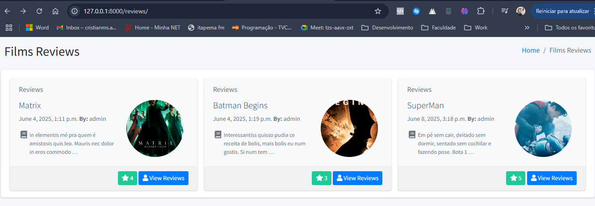
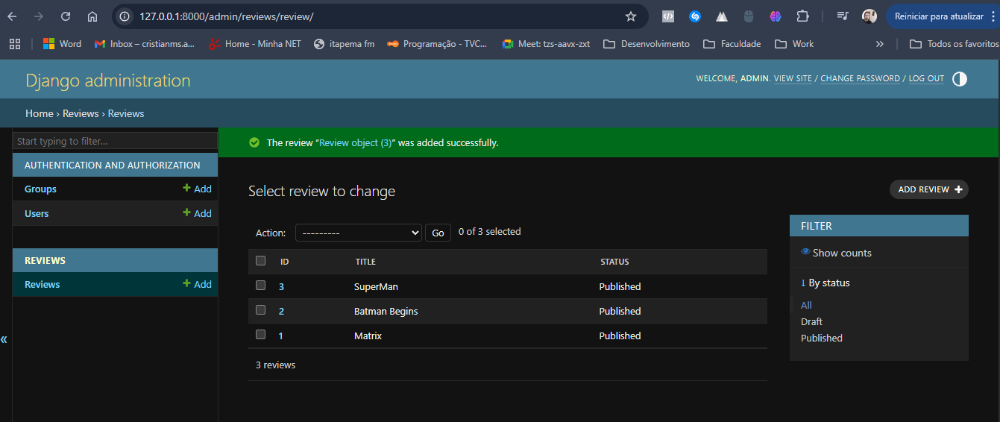

# 🎬 Film Reviews

Sistema simples desenvolvido com Django para cadastro, listagem e visualização de resenhas de filmes. Os usuários podem ver detalhes como título, autor, imagem, nota e descrição de cada filme publicado.




---
# Projeto: Análise de Sentimento com IA Generativa + Busca Semântica com FAISS

Este projeto demonstra como integrar o modelo GPT-3.5 da OpenAI com FAISS para análise de sentimento e busca semântica de críticas de filmes.

## Tecnologias
- **Linguagem**: Python 3.10
- **Backend**: FastAPI
- **IA Generativa**: OpenAI GPT-3.5
- **Busca Vetorial**: FAISS + OpenAIEmbeddings

## Estrutura
- `app.py`: Roteamento básico com FastAPI
- `gpt_analysis.py`: Funções para comunicação com a API OpenAI
- `faiss_search.py`: Geração de embeddings e busca vetorial
- `data/reviews_sample.json`: Dataset de exemplo

## Como rodar
```bash
pip install -r requirements.txt
uvicorn app:app --reload
## 📌 Funcionalidades

- Listagem de filmes publicados com imagem e nota
- Visualização detalhada do review
- Cadastro via painel admin do Django
- Upload de imagem do filme
- Responsivo e com layout baseado no AdminLTE

---

## 🧰 Tecnologias utilizadas

- [Python 3.12](https://www.python.org/)
- [Django 5.2](https://www.djangoproject.com/)
- [Bootstrap 4](https://getbootstrap.com/)
- [AdminLTE 3](https://adminlte.io/)
- [SQLite 3 (banco de dados local)]

---

## 📁 Estrutura do Projeto

film_review/
│
├── reviews/ # App principal
│ ├── migrations/ # Migrations do Django
│ ├── static/ # Arquivos estáticos (CSS, JS, Imagens)
│ │ ├── css/
│ │ └── img/
│ ├── templates/
│ │ └── reviews/
│ │ ├── base.html
│ │ ├── list.html
│ │ └── detail.html
│ ├── admin.py
│ ├── models.py
│ ├── views.py
│ ├── urls.py
│ └── ...
├── film_review/ # Configurações do projeto
│ ├── settings.py
│ ├── urls.py
│ └── ...
└── db.sqlite3 # Banco de dados local


---

## 🚀 Como rodar localmente

### 1. Clone o projeto

```bash
git clone https://github.com/seu-usuario/film-reviews.git
cd film-reviews


2. Crie um ambiente virtual e ative
python -m venv venv
source venv/bin/activate  # Linux/Mac
venv\Scripts\activate     # Windows


3. Instale as dependências
pip install django

4. Rode as migrações
python manage.py migrate

5. Crie um superusuário (para acessar o admin)
python manage.py createsuperuser

6. Inicie o servidor
python manage.py runserver
Acesse: http://127.0.0.1:8000/reviews/

🖼️ Upload de Imagens
O modelo Review possui um campo de imagem:

image = models.ImageField(upload_to='reviews_images/', blank=True, null=True)
Certifique-se de ter:

A pasta media/ criada na raiz

Configurações no settings.py:
MEDIA_URL = '/media/'
MEDIA_ROOT = BASE_DIR / 'media'

E no urls.py principal:

from django.conf import settings
from django.conf.urls.static import static

urlpatterns += static(settings.MEDIA_URL, document_root=settings.MEDIA_ROOT)

✍️ Como contribuir
Faça um fork
Crie uma branch: git checkout -b minha-feature
Faça commits: git commit -m 'Minha feature'
Envie sua branch: git push origin minha-feature

📄 Licença
MIT © Seu Nome